

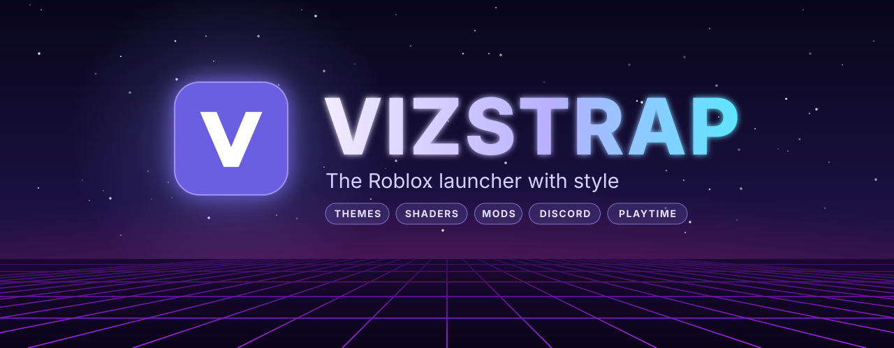

### A Roblox launcher with themes, mods, shaders, Discord presence and play-time stats.
Everything you'd expect from a Bloxstrap-style launcher - and a lot more on top.

 

---

## ✨ Features

| Feature | What it does |
|---|---|
| 🚀 **Launches Roblox** | Downloads, installs and updates the Roblox Player itself. A new Roblox version downloads **in the background** while you play. |
| 🌈 **Shaders** | Approximate ray tracing over the game: contact shadows, bounced light, reflections, sun rays, haze, background blur and glow. |
| 🎨 **Loading windows** | 9 classic styles, a simple theme editor and **Bloxstrap-compatible XML themes** - 4 of them built in. |
| 🧩 **Mods** | Bloxstrap's mods folder, one-click presets (cursors, sounds, emoji, fonts) and shareable **`.vzmod` mod packages**. |
| 🎮 **Discord Rich Presence** | The game you're in, its creator, time played, an optional **Join** button - and "Powered by Vizstrap". |
| ⏱️ **Playtime** | How long you played which game: **today, this week and all time**, with a 7-day chart. |
| ⚙️ **Engine settings** | Fast Flag presets and an editor that knows which flags Roblox still accepts. |
| 👥 **Several Robloxes** | Open more than one Roblox at the same time, for example for a second account. |
| 🖱️ **Tray menu** | Invite link to your server, server location, game history with **Rejoin**, close Roblox. |
| 🌐 **8 languages** | English · Polski · Deutsch · Français · Español · Português (BR) · Русский · 中文 |
| 📦 **One file** | A single `Vizstrap.exe` is the installer, the updater and the launcher. No admin rights needed. |

## 📸 Screenshots

<table>
  <tr>
    <td width="50%">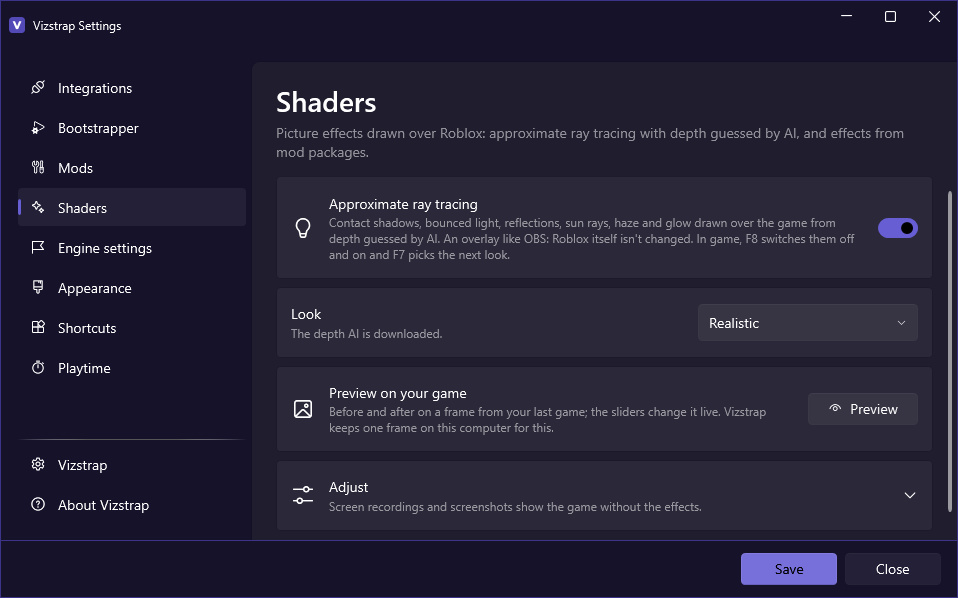</td>
    <td width="50%">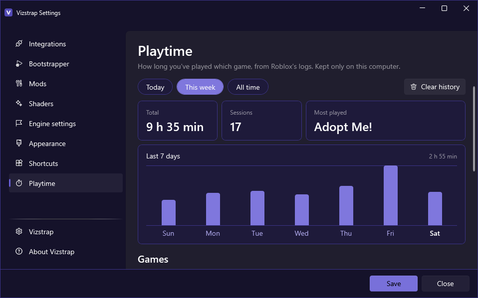</td>
  </tr>
  <tr>
    <td align="center"><b>🌈 Shaders</b> - approximate ray tracing</td>
    <td align="center"><b>⏱️ Playtime</b> - today, this week, all time</td>
  </tr>
  <tr>
    <td width="50%">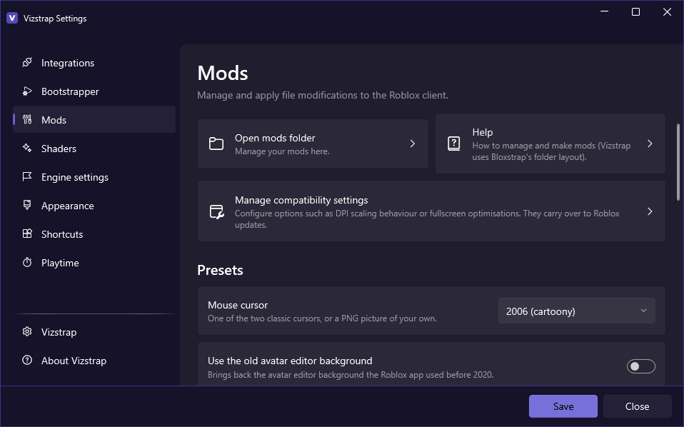</td>
    <td width="50%">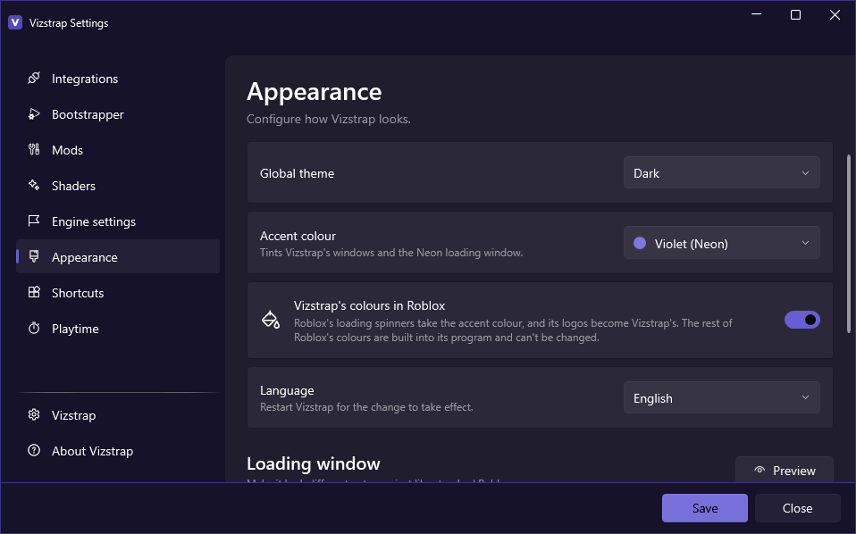</td>
  </tr>
  <tr>
    <td align="center"><b>🧩 Mods</b> - presets and mod packages</td>
    <td align="center"><b>🎨 Appearance</b> - themes, accent colours, languages</td>
  </tr>
  <tr>
    <td width="50%">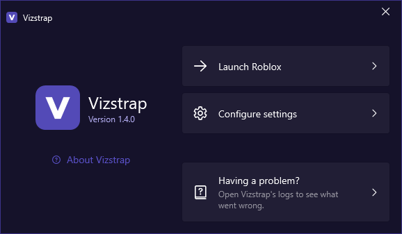</td>
    <td width="50%">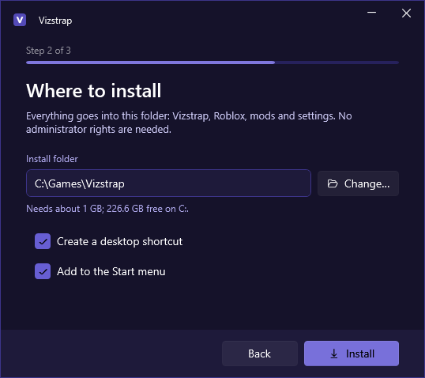</td>
  </tr>
  <tr>
    <td align="center"><b>🚀 Menu</b> - launch Roblox or open the settings</td>
    <td align="center"><b>📥 Installer</b> - pick where Vizstrap goes</td>
  </tr>
</table>

## 📥 Installation

1. Download **`Vizstrap.exe`** from the [**latest release**](https://github.com/Jagm3nz/Vizstrap/releases/latest).
2. Run it and follow the installer:
   - pick your **language**;
   - pick the **install folder** - `%LocalAppData%\Vizstrap` by default, or any folder you like (everything goes there: Vizstrap, Roblox, mods and settings);
   - choose the **desktop** and **Start menu** shortcuts.
3. A short setup wizard asks about the look, Discord and a few Roblox settings - then you're ready.

From now on, the **Play** buttons on roblox.com open through Vizstrap.

> [!TIP]
> **Updating:** download the new `Vizstrap.exe` and run it - it updates the installed Vizstrap in place, your settings stay.

> [!NOTE]
> Windows may say **"Windows protected your PC"** because the file isn't code-signed. Click **More info → Run anyway**.

## 🌈 Shaders

Vizstrap can draw **approximate ray tracing** over Roblox. An AI model guesses how far away everything on screen is,
and your graphics card uses that to add light and shadow the game doesn't have.

| Effect | What you see |
|---|---|
| 🌑 **Contact shadows** | Soft shadows in corners and where objects meet |
| 💡 **Bounced light** | Colour from bright surfaces spills onto nearby ones |
| 🌊 **Reflections** | A sheen of the scene on floors and water |
| ☀️ **Sun rays** | Light shafts from bright skies |
| 🌫️ **Haze & background blur** | Depth for far-away scenery |
| ✨ **Glow, contrast, colour** | Bloom, warmth, saturation, vignette and sharpening |

**Looks:** Realistic · Cinematic · Vivid · Light *(no AI)* · Custom - with a slider for every effect and a **before/after preview** on a frame from your last game.

| Key | In game |
|---|---|
| <kbd>F8</kbd> | Switch the shaders off and on |
| <kbd>F7</kbd> | Next look (its name shows on screen) |

> [!NOTE]
> The shaders are an **overlay**, like OBS - Roblox itself is never modified. Screenshots and recordings show the game without them.
> The depth AI (about 50 MB) downloads the first time and runs on the graphics card.

## 🎨 Loading windows

<table>
  <tr>
    <td align="center">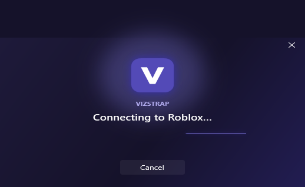 <b>Neon</b></td>
    <td align="center">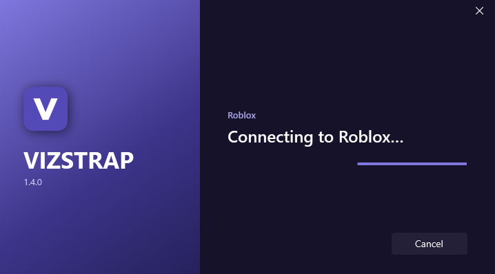 <b>Split</b></td>
    <td align="center">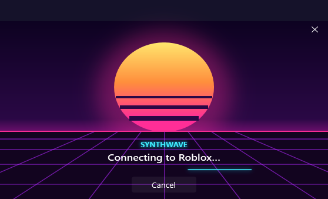 <b>Synthwave</b> (example mod pack)</td>
  </tr>
  <tr>
    <td align="center">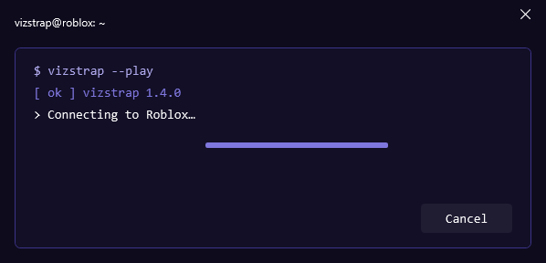 <b>Terminal</b></td>
    <td align="center">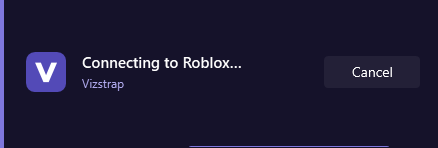 <b>Minimal</b></td>
    <td></td>
  </tr>
</table>

| Kind | Included |
|---|---|
| 🕹️ **Classic styles** | Neon, Fluent, Classic, Compact, Roblox ~2014, Fake Byfron, Legacy 2011, Legacy 2008, Vista |
| 🖌️ **Theme editor** | Background colour or picture, dimming, text and bar colours, 4 layouts, 3 sizes, your own icon |
| 📄 **XML themes** | Bloxstrap's theme format - themes made for Bloxstrap work as they are; import a ZIP or your Bloxstrap themes |
| 🎨 **Accent colours** | 7 colours for Vizstrap's windows - violet Neon by default |
| 🖼️ **Icons** | Roblox icons from 2008 to 2022, or your own `.ico` |

## 🧩 Mods

**Presets** - one click, no files to hunt for:

| Preset | Options |
|---|---|
| 🖱️ Mouse cursor | 2006 · 2013 · your own PNG |
| 🔊 Sounds | Classic character sounds · death sound: "oof", muted or your own file |
| 😀 Emoji | Catmoji · Windows 11 · Windows 10 · Windows 8 · OpenMoji · EmojiTwo |
| 🔤 Font | Replace every in-game font with your own `.ttf` / `.otf` |
| 🧍 Avatar editor | The old avatar editor background |

The **mods folder** uses Bloxstrap's layout, so [Bloxstrap's modding guide](https://bloxstraplabs.com/wiki/features/modding/) works too.
Original files come back automatically when you remove a mod.

### 📦 Mod packages (`.vzmod`)

A mod package is one file you can share - install it with **Mods → Mod packages → Install a package**.

| Inside a package | What it adds |
|---|---|
| 📁 **Game files** | Replaced Roblox files (cursors, sounds, textures…) |
| 🌈 **Shaders** | Your own picture effects with sliders, on the Shaders page |
| 🎨 **Loading themes** | Bloxstrap-format loading windows |
| 🔌 **A program** | Starts with Roblox and gets told when you join or leave a game - it asks before running |

**Make your own** creates a starter folder with a guide and examples, and **Pack a folder** turns it into a `.vzmod`.
The release also has an example: **Synthwave Pack** - a neon cursor, 3 shaders (Synthwave, Toon outlines, Retro TV), a sunset loading theme and "Now playing" notifications.

## 🎮 Integrations

| Integration | What it does |
|---|---|
| 💬 **Discord Rich Presence** | Game, creator, time, game icon; optionally your Roblox account and a **Join** button; supports BloxstrapRPC |
| 🌍 **Server location** | A notification with where the game server is |
| 📜 **Game history** | The games of this session in the tray menu, with **Rejoin** |
| ⏱️ **Playtime** | Time per game from Roblox's logs, kept only on your computer |
| 🔁 **Background updates** | New Roblox versions download while you play, so launches don't wait |
| 🚪 **No Roblox app** | Optionally close Roblox when you leave a game instead of returning to its app |
| ▶️ **Your programs** | Start your own programs together with Roblox |

## ❓ FAQ

<b>Is it safe? Can I get banned?</b>

Vizstrap starts the official Roblox Player - it doesn't inject anything into Roblox or touch its memory. Mods only replace content files
(the same way Bloxstrap does), and the shaders are a separate overlay window on top of the game.

<b>Windows says the file is dangerous.</b>

`Vizstrap.exe` isn't code-signed, so SmartScreen warns about any new download. Click **More info → Run anyway**.

<b>I use Bloxstrap. Can I switch?</b>

Yes. Vizstrap takes over the Roblox links and remembers which launcher had them - uninstalling Vizstrap gives them back.
Your Bloxstrap XML themes can be imported in **Appearance**.

<b>Why don't the shaders show up in my recordings?</b>

The overlay hides itself from screen capture on purpose - otherwise it would capture itself. The game you record is the game without effects.

<b>Where are my files? How do I uninstall?</b>

Everything is in the folder you picked during installation. Uninstall from **Settings → Vizstrap → Uninstall** or from Windows' **Apps and features**.

## 🐞 Support

Found a bug or have an idea? [Open an issue](https://github.com/Jagm3nz/Vizstrap/issues) - the **Having a problem?** button in Vizstrap's menu opens its logs, attach them if you can.

## 🙏 Credits

- [**Bloxstrap**](https://github.com/bloxstraplabs/bloxstrap) - the idea, the mod layout, the XML theme format and several assets (MIT)
- [**Depth Anything V2**](https://github.com/DepthAnything/Depth-Anything-V2) - the depth AI behind the shaders (Apache 2.0)
- [**OpenMoji**](https://openmoji.org) and [**Emojitwo**](https://github.com/EmojiTwo/emojitwo) - emoji sets

The full list is in [THIRD-PARTY-NOTICES.md](THIRD-PARTY-NOTICES.md).

## ⚖️ Disclaimer

Vizstrap is not affiliated with, endorsed by or connected to Roblox Corporation. Roblox and its logos are trademarks of Roblox Corporation.

## 📜 License

Vizstrap is **free to use**. Redistribution and re-uploading are not allowed - see [LICENSE](LICENSE.md).

 
Made with 💜 by <a href="https://github.com/Jagm3nz">Jagm3nz</a>

